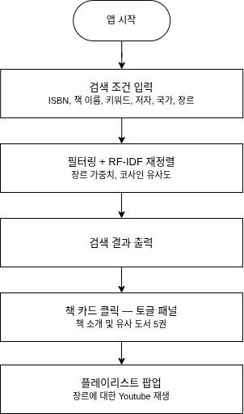

# 도서 수호자 (Book Guardian)

> YES24 기반 데이터를 활용한 AI 도서 추천 및 장르별 음악 플레이리스트 연동 데스크톱 애플리케이션

## 1. Overview

| 항목 | 내용 |
|------|------|
| 플랫폼 | Desktop (PyQt5) |
| 언어 | Python |
| 도구 | PyCharm, PyQt5 Designer |
| 데이터 | YES24 도서 데이터, YouTube (yt-dlp) |
| 개발 기간 | 2026.06.10 - 06.17 |
| 팀 구성 | 3인 팀 프로젝트 |

---

## 2. 주요 기능

- **작가 기반 도서 검색**: `작가` 컬럼 기준 자동완성 검색으로 원하는 도서를 빠르게 탐색
- **유사 도서 추천**: 선택한 도서를 기준으로 유사 도서 5권을 자동 추천
- **장르 기반 플레이리스트 추천**: 도서 장르에 맞는 YouTube 플레이리스트를 최대 10곡까지 자동 매칭
- **통합 토글 패널 UI**: 책 소개, 유사 도서, 플레이리스트 버튼을 한 화면에서 확인 가능한 토글 패널 제공

## 3. 담당 역할

**UI 설계 및 음악 플레이리스트 데이터 크롤링/전처리**

- **PyQt5 기반 토글 패널 UI 개발**
  `book_recommend_app`을 베이스로 책 소개, 유사 도서 5권, 플레이리스트 버튼을 포함한 토글 패널을 `recommend_system`에 구현. `BookDetailPanel`의 `pyqtSignal(dict)`을 통해 선택한 도서 정보를 메인 앱으로 전달하는 시그널 체계 설계

- **YouTube 플레이리스트 자동 크롤링 및 전처리 (Python, yt-dlp)**
  장르별 음악을 자동 수집하는 `playlist_auto_crawl.py` 구현. 최소 30분 이상 재생 길이 필터링과 중복 제거 로직을 적용하고, `GENRE_MAP` 기반으로 도서 장르와 플레이리스트 장르를 매칭

## 4. 시스템 아키텍처 및 핵심 구현

### 핵심 구현

| 구현 | 설명 |
|---|---|
| **① 작가 컬럼 기반 자동완성 검색** | `final_merge_preprocessed_writer.csv`의 `작가` 컬럼만을 검색 대상으로 한정하여 저자/번역가 혼동 없이 정확한 자동완성 제공 |
| **② 시그널 기반 패널 연동** | `BookDetailPanel`의 `pyqtSignal(dict)`로 선택한 도서 정보를 메인 앱의 `open_playlist()`에 전달, UI 컴포넌트 간 느슨한 결합 구조 구현 |
| **③ 장르 매핑 기반 플레이리스트 추천** | `GENRE_MAP` 딕셔너리로 도서 장르와 YouTube 플레이리스트 장르를 매칭, 최대 10곡으로 추천 결과 제한 |

## 5. 트러블슈팅

| 발생 문제 | 발생 원인 | 해결 방안 | 결과 |
|-----------|-----------|-----------|------|
| QWidget 배경색 미적용 | PyQt5 QWidget은 기본적으로 스타일시트 배경이 렌더링되지 않음 | `setAttribute(Qt.WA_StyledBackground, True)` 명시적 설정 | 토글 패널 배경 정상 렌더링 확보 |
| 장르명 매칭 실패 | `GENRE_MAP`의 키와 크롤링 데이터의 장르 표기 형식 불일치 (`/` vs `,`) | 두 데이터 소스의 장르 표기를 동일 포맷으로 통일 | 플레이리스트 매칭 정상화 |

## 6. 디렉토리 구조 (Directory Structure)

| 파일 | 역할 |
|------|------|
| `book_recommend_app.py/.ui` | 도서 검색 베이스 UI |
| `recommend_system.py/.ui` | 메인 진입점, 토글 패널(책 소개/유사 도서/플레이리스트) 포함 |
| `playlist_recommend_app.py/.ui` | 장르 기반 플레이리스트 팝업 (QDialog) |
| `playlist_auto_crawl.py` | yt-dlp 기반 장르별 플레이리스트 크롤러 |
| `data/final_merge_preprocessed_writer.csv` | 작가/출판사 전처리 완료 도서 데이터 |
